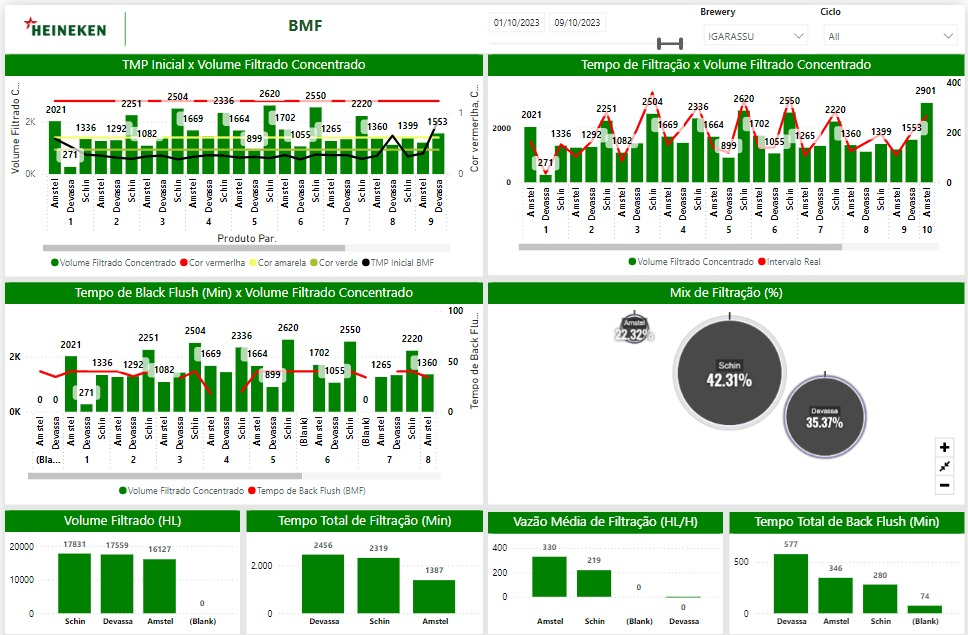
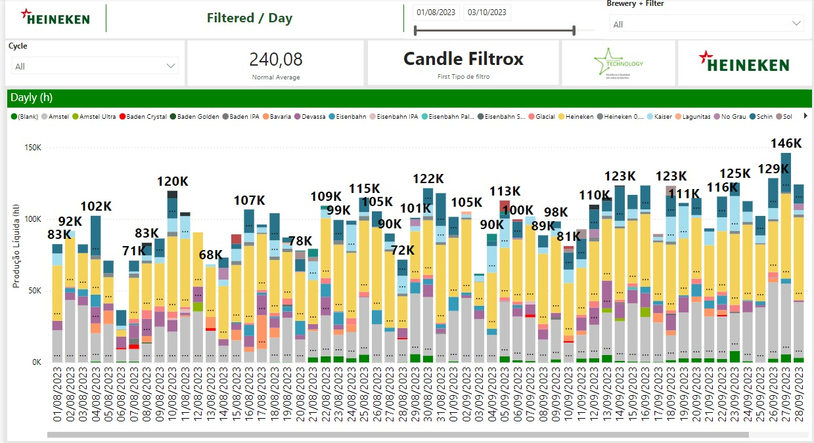
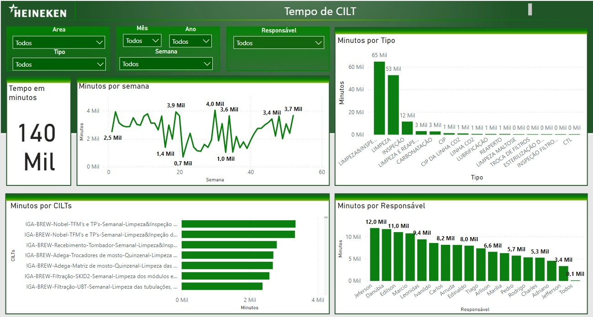
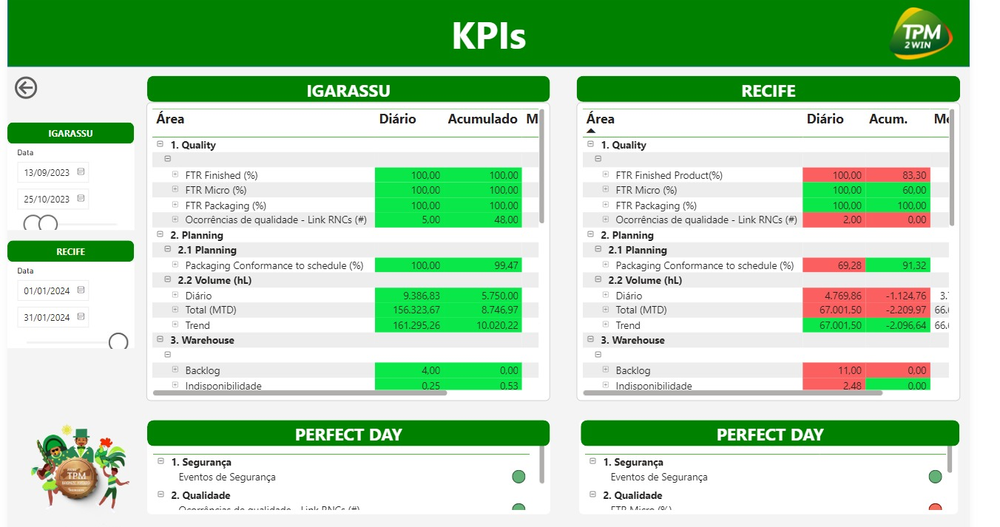
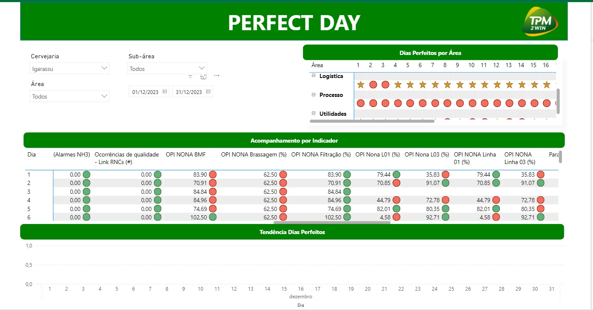
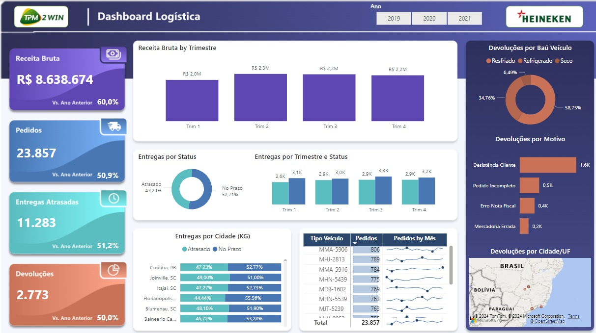
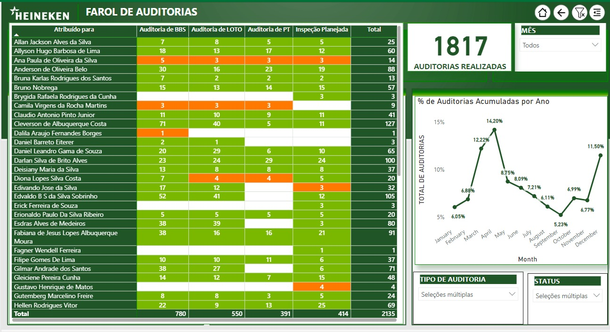
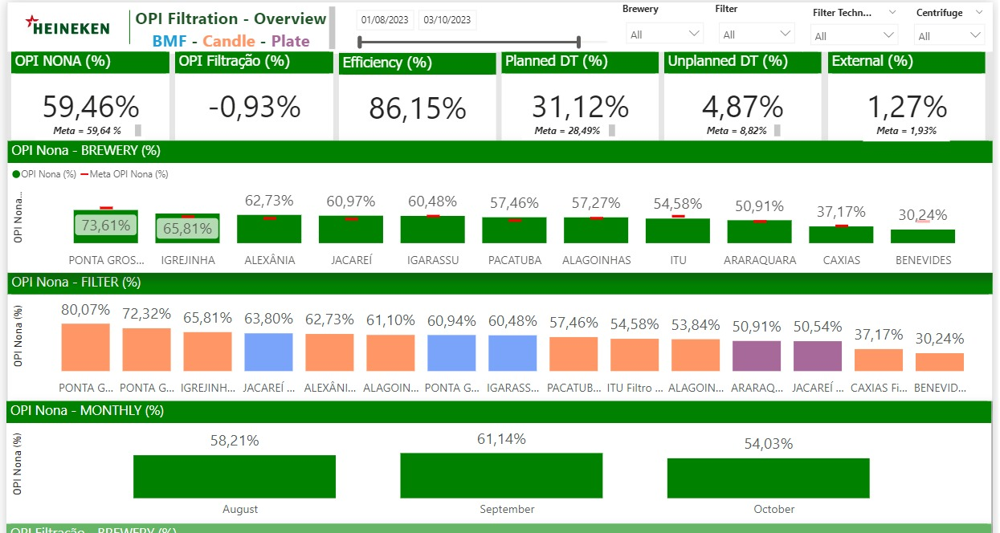

# Meus Projeto

## Entendimento do Problema

Esse é um repertório de BI's e cases que participei, esse arquivo foi criado para ajudar no processo de ideação dos seus trabalhos.

### Dashboard para BMF - HNK Brasil

Visualização detalhada dos indicadores de performance do sistema de filtração BMF na HNK Brasil. Fornece insights para melhorar a eficiência e qualidade do processo de filtração.

   

### Dashboard para filtração - HNK Brasil

Monitoramento dos processos de filtração com indicadores-chave de eficiência e qualidade. Ajuda a identificar pontos de melhoria e otimizar o desempenho do sistema.

   

### Dashboard perdas Envase

Análise de perdas durante o processo de envase para otimização e redução de desperdícios. Focaliza em identificar causas principais das perdas e propor soluções para mitigá-las.

   

### Dashboard para Acompanhamento de Execução de Cilt

Rastreamento e análise da execução das atividades de limpeza, inspeção, lubrificação e reaperto (CILT). Facilita o acompanhamento das rotinas de manutenção preventiva e corretiva.

   

### Dashboard para Acompanhamento de Tempo de Cilt

Medição do tempo gasto em cada etapa do processo de limpeza, inspeção, lubrificação e reaperto (CILT). Permite a identificação de gargalos e a melhoria dos tempos de execução.

   

### Dashboard com KPI unificados

Consolidação de indicadores de performance chave (KPIs) de diferentes áreas da empresa. Facilita a visualização integrada e a análise comparativa dos principais KPIs.

   

### Dashboard Dias Perfeitos

Visualização e acompanhamento dos dias de operação sem falhas ou interrupções. Ajuda a identificar padrões e fatores que contribuem para a operação perfeita.

   

### Dashboard Logistica

Análise dos processos logísticos com foco em eficiência e otimização. Fornece uma visão abrangente das atividades logísticas e dos pontos de melhoria.

   

### Dashboard BSC

Balanced Scorecard para monitoramento e avaliação de desempenho estratégico. Facilita o alinhamento das atividades empresariais com a estratégia organizacional.

   

### Dashboard Controle de Auditorias

Gestão e controle de auditorias internas e externas com indicadores de conformidade. Ajuda a garantir que todas as áreas estejam em conformidade com as normas e regulamentos.

   

### Dashboard OPI Brewery

Indicadores de Performance Operacional (OPI) específicos para a operação de cervejarias. Permite o monitoramento contínuo da produção e a identificação de áreas para melhoria.

   

### Passos Seguidos na Criação de um Dashboard através da Metodologia 5P

1. **Problema**
   - **Identificação do Problema**: Definição clara do problema ou necessidade que o dashboard irá abordar. Exemplo: Monitoramento de perdas no processo de envase.
   - **Análise de Requisitos**: Coleta de informações sobre as necessidades dos usuários finais e os dados necessários para resolver o problema identificado.
   - **Definição de Objetivos**: Estabelecimento de objetivos específicos e mensuráveis que o dashboard deve alcançar. 

2. **Plano**
   - **Planejamento do Projeto**: Criação de um plano detalhado que inclui as etapas do projeto, os prazos e os recursos necessários.
   - **Criação do Cronograma**: Desenvolvimento de um cronograma para a execução das tarefas, definindo prazos para cada etapa.
   - **Atribuição de Tarefas**: Designação clara das responsabilidades para cada membro da equipe, garantindo que todos saibam suas tarefas específicas.

3. **Processo**
   - **Coleta de Dados**: Extração dos dados necessários de fontes relevantes e garantia de sua qualidade e integridade.
   - **Análise de Dados**: Processamento e análise dos dados para extrair insights relevantes e preparar as informações para visualização.
   - **Desenvolvimento do Dashboard**: Construção do dashboard utilizando ferramentas de BI, como Power BI, Tableau ou outras, com base nos dados analisados.

4. **Produção**
   - **Testes e Validação**: Realização de testes para garantir que o dashboard funcione corretamente e atenda aos requisitos definidos. Inclui a validação dos dados e a verificação da usabilidade.
   - **Feedback dos Usuários**: Coleta de feedback dos usuários finais para identificar melhorias e ajustes necessários antes do lançamento oficial.
   - **Ajustes Finais**: Implementação de melhorias e ajustes com base no feedback recebido e nos testes realizados.

5. **Performance**
   - **Monitoramento Contínuo**: Implementação de um sistema para monitorar o desempenho do dashboard em tempo real, garantindo que ele continue atendendo às necessidades dos usuários.
   - **Manutenção e Atualizações**: Realização de manutenção regular e atualizações para incorporar novos dados, corrigir problemas e melhorar a funcionalidade.
   - **Análise de Impacto**: Avaliação do impacto do dashboard nas operações e na tomada de decisões, ajustando conforme necessário para maximizar os benefícios.

Seguir esses passos garante uma abordagem estruturada e eficaz para a criação de dashboards, resultando em ferramentas úteis e funcionais que atendem às necessidades dos usuários e ajudam na tomada de decisões informadas.
